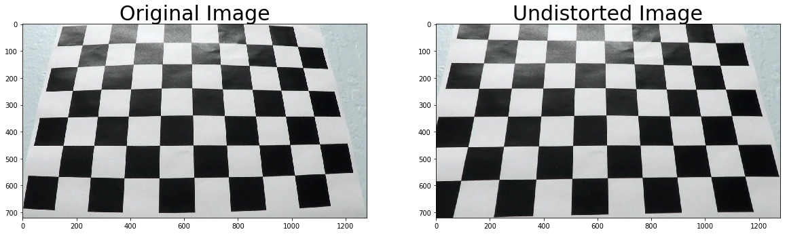
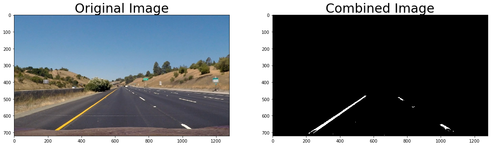
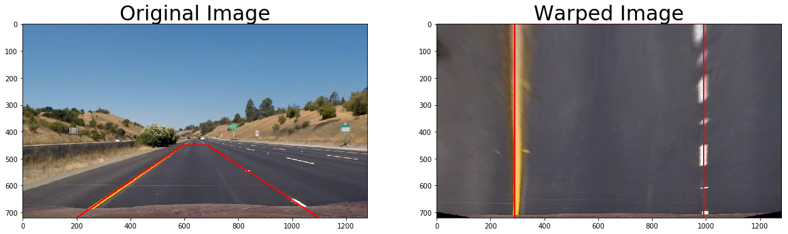
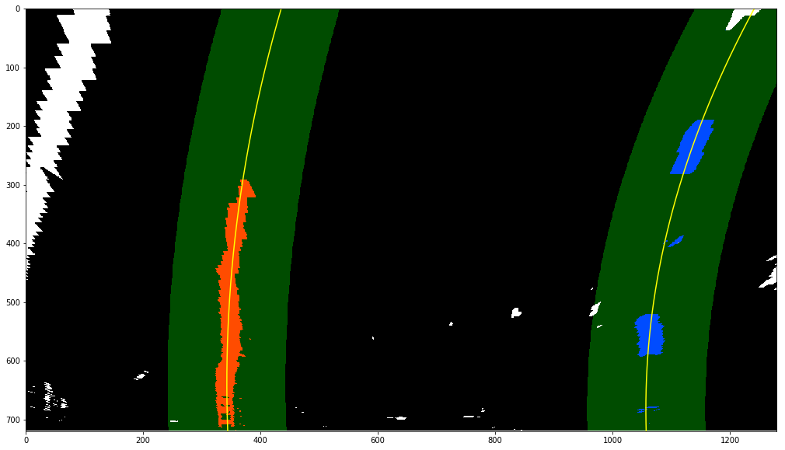
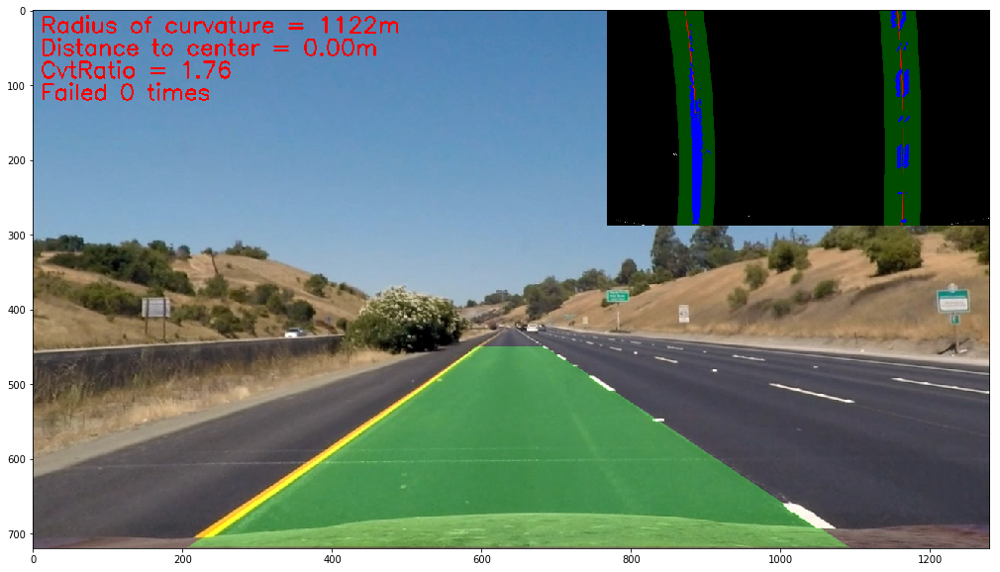

# Advanced Lane Finding Project

The goals / steps of this project are the following:

* Compute the camera calibration matrix and distortion coefficients given a set of chessboard images.
* Apply a distortion correction to raw images.
* Use color transforms, gradients, etc., to create a thresholded binary image.
* Apply a perspective transform to rectify binary image ("birds-eye view").
* Detect lane pixels and fit to find the lane boundary.
* Determine the curvature of the lane and vehicle position with respect to center.
* Warp the detected lane boundaries back onto the original image.
* Output visual display of the lane boundaries and numerical estimation of lane curvature and vehicle position.

[//]: # (Image References)

[image1]: ./examples/undistort_output.png "Undistorted"
[image2]: ./test_images/test1.jpg "Road Transformed"
[image3]: ./examples/binary_combo_example.jpg "Binary Example"
[image4]: ./examples/warped_straight_lines.jpg "Warp Example"
[image5]: ./examples/color_fit_lines.jpg "Fit Visual"
[image6]: ./examples/example_output.jpg "Output"
[video1]: ./project_video.mp4 "Video"

## [Rubric](https://review.udacity.com/#!/rubrics/571/view) Points

### Here I will consider the rubric points individually and describe how I addressed each point in my implementation.  

---

### Writeup / README

#### 1. Provide a Writeup / README that includes all the rubric points and how you addressed each one.  You can submit your writeup as markdown or pdf.  [Here](https://github.com/udacity/CarND-Advanced-Lane-Lines/blob/master/writeup_template.md) is a template writeup for this project you can use as a guide and a starting point.  

You're reading it!

### Camera Calibration

#### 1. Briefly state how you computed the camera matrix and distortion coefficients. Provide an example of a distortion corrected calibration image.

The code for this step is contained in the first and second code cell of the IPython notebook [AdvancedLanelineDetection.ipynb](./AdvancedLanelineDetection.ipynb).  

I start by preparing "object points", which will be the (x, y, z) coordinates of the chessboard corners in the world. Here I am assuming the chessboard is fixed on the (x, y) plane at z=0, such that the object points are the same for each calibration image.  Thus, `objp` is just a replicated array of coordinates, and `objpoints` will be appended with a copy of it every time I successfully detect all chessboard corners in a test image.  `imgpoints` will be appended with the (x, y) pixel position of each of the corners in the image plane with each successful chessboard detection.  

I then used the output `objpoints` and `imgpoints` to compute the camera calibration and distortion coefficients using the `cv2.calibrateCamera()` function.  I applied this distortion correction to the test image using the `cv2.undistort()` function and obtained this result: 

<div style="text-align:center"></div>

### Pipeline (single images)

#### 1. Provide an example of a distortion-corrected image.

To demonstrate this step, I will describe how I apply the distortion correction to one of the test images like this one:

<div style="text-align:center"></div>

#### 2. Describe how (and identify where in your code) you used color transforms, gradients or other methods to create a thresholded binary image.  Provide an example of a binary image result.

I used a combination of color and gradient thresholds to generate a binary image (thresholding steps at code cell 4).  Here's an example of my output for this step.

<div style="text-align:center"></div>

#### 3. Describe how (and identify where in your code) you performed a perspective transform and provide an example of a transformed image.

The code for my perspective transform appears in the code cell 5. I set the `src` and `dst` points manuely and after a few times of trial and error, I got the following points:

```py
# Set the view of perspective
pts_list = [[200,height],[595, 450], [686,450], [1100,height]]
pts_list_dst = [[290,height],[290,0],[989,0],[989,height]]
```

I verified that my perspective transform was working as expected by drawing the `src` and `dst` points onto a test image and its warped counterpart to verify that the lines appear parallel in the warped image.

<div style="text-align:center"></div>

#### 4. Describe how (and identify where in your code) you identified lane-line pixels and fit their positions with a polynomial?

In code cell 11 of the IPython notebook file, I implemented the function to detection lane line pixels and fit them with polynomials.

Here are the steps:

1. Undistort the image
2. Get the binary image using color transforms and gradients with thresholding
3. Warp the binary image to get a bird view image
4. Use histogram of the warped binary image to find lane line pixels
5. Fit found pixels using polynomials

Then I did some other stuff and fit my lane lines with a 2nd order polynomial kinda like this:

<div style="text-align:center"></div>

#### 5. Describe how (and identify where in your code) you calculated the radius of curvature of the lane and the position of the vehicle with respect to center.

I did this in lines 628 through 650 in my code in [detector.py](./detector.py).

#### 6. Provide an example image of your result plotted back down onto the road such that the lane area is identified clearly.

I implemented this step in the code cell 13 of the IPython notebook file. Here is an example of my result on a test image:

<div style="text-align:center"></div>

---

### Pipeline (video)

#### 1. Provide a link to your final video output.  Your pipeline should perform reasonably well on the entire project video (wobbly lines are ok but no catastrophic failures that would cause the car to drive off the road!).

Here's a [link to my video result](./output_images/project_output.mp4)

---

### Discussion

#### 1. Briefly discuss any problems / issues you faced in your implementation of this project.  Where will your pipeline likely fail?  What could you do to make it more robust?

Here are the steps I used in this project:

1. Calibration
    * Get the camera matrix and distortion coefficients
2. Perspective Transform
    * Get a bird view of the road such that the lanelines are properly fitted

3. Color transforms and gradients
    * Different color transforms perform different on laneline detection depend on light conditions
4. Combine the above three steps to get a binary warped image. Then extract laneline pixels using histogram
5. Fit lanelines using polynomials and calculate curvatures
6. Buffer detected lanelines to filter some outliers
7. Plot the detected lanelines on the input image

The pipeline could fail if:
    1. the light condition is abnormal, for example, very dark, very bright, or shadows. The color transformed features are sensitive to light conditions
    2. the road is very curved. Because we buffer the detected lanelines and smooth the polynomial coeeficients using averaged values, the pipeline could be delayed to update fitting coefficients
    